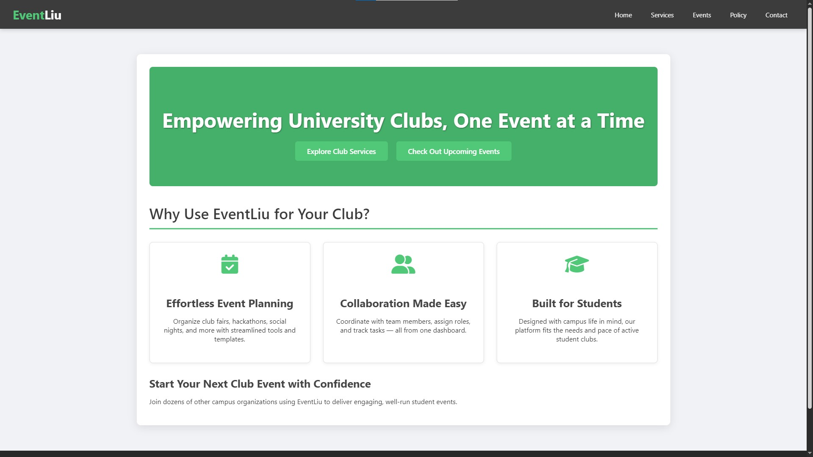
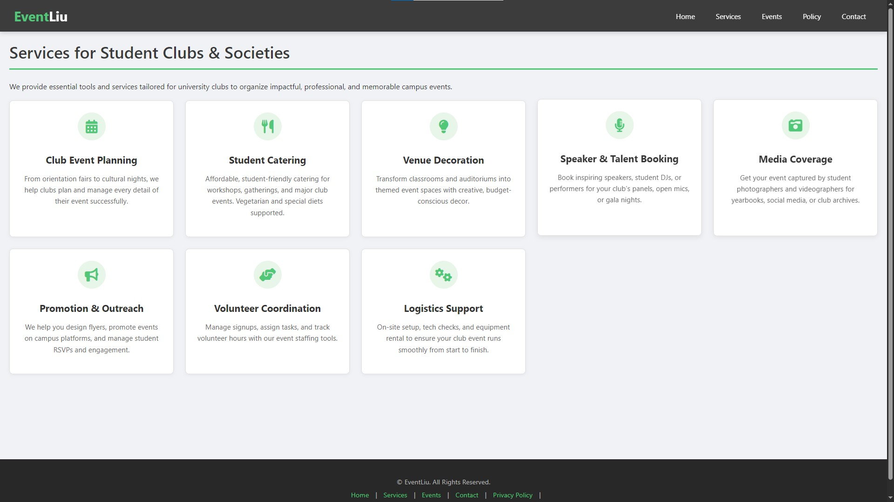
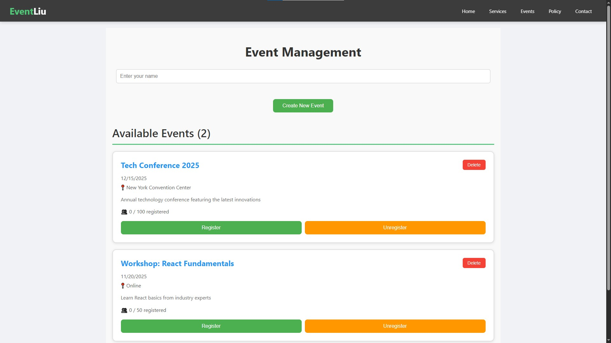

# Web Project One

## Project Description

Web Project One is a modern web application designed to provide users with an engaging and interactive experience. The application features multiple pages, including Home, Services, Events, Contact, and more. It is built using React and follows best practices for component-based architecture.

## Setup Instructions

To set up and run this project locally, follow these steps:

1. **Clone the repository:**

   ```bash
   git clone https://github.com/younissjaafil/web_project_one.git
   ```

2. **Navigate to the project directory:**

   ```bash
   cd web_project_one
   ```

3. **Install dependencies:**
   Ensure you have Node.js installed, then run:

   ```bash
   npm install
   ```

4. **Start the development server:**

   ```bash
   npm start
   ```

   The application will be available at `http://localhost:3000`.

5. **Build for production (optional):**
   To create an optimized production build, run:
   ```bash
   npm run build
   ```

## Screenshots

### Home Page



### Services Page



### Events Page


